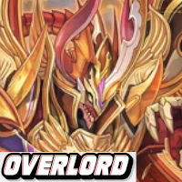

# G-Less Deck Compendium (HTML / CSS / JS)

A simple, offline-friendly version of the catalog. **No build step. No React.**

## Open it

1. Unzip / open the `g-less-compendium` folder.
2. Double-click **`index.html`**, or open it in your browser.

Search, nation jump links, and hover glow work from `app.js`.  
**Clicking a deck opens its link** (no popup).

## Folder layout

```
g-less-compendium/
  index.html      ← all page content + deck links
  styles.css      ← look & feel, glow, colors
  app.js          ← search + nation chips only
  art/
    nations/      ← flag images
    emblems/      ← clan crests
    decks/        ← deck thumbnails
  README.md
```

## Deck links (important)

Each deck is a normal link. In `index.html` it looks like:

```html
<a class="deck-tile" href="https://example.com/decks/overlord" data-name="Overlord" ...>
  
</a>
```

**Change only the `href="..."`** to your real URL (decklist page, wiki, Google Doc, etc.).

Right now every deck uses a placeholder under `https://example.com/decks/...` so you can find/replace them easily.

Tip: in your editor, search for `https://example.com/decks/` and replace each path with the real one.

## Edit wording

### Clan description

```html
<h3>Royal Paladin</h3>
<p>A knight order which gains strength from their allies</p>
```

### Deck name

Update these together so search stays correct:

- `data-name="…"`
- `alt="…"` on the image

### Nation / clan title

```html
<h2>United Sanctuary</h2>
<h3>Royal Paladin</h3>
```

## Change images

1. Prepare a PNG (square is best for decks).
2. Overwrite the file in `art/decks/`, `art/emblems/`, or `art/nations/` **with the same filename**.
3. Hard-refresh the browser (Ctrl+Shift+R / Cmd+Shift+R).

## Add a new deck

1. Add `art/decks/my-new-deck.png`.
2. Copy an existing `<a class="deck-tile" …>` in the right clan’s `.deck-grid`.
3. Set `href` to your page, and update `data-name`, `src`, and `alt`.

## Put it on the web

Upload the whole folder to GitHub Pages, Netlify, Cloudflare Pages, or any static host.

## Colors

Nation accents are at the top of **`styles.css`** (`--us`, `--de`, etc.).
